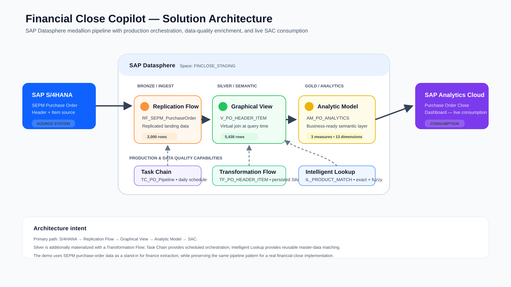
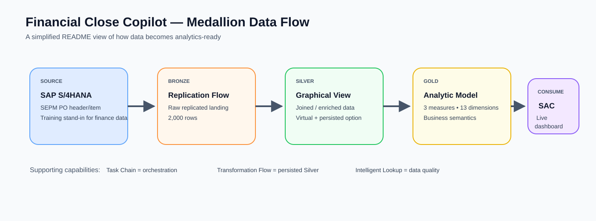

# Financial Close Copilot — Project README

**Status: COMPLETE**

## What this project is

An end-to-end SAP Datasphere data layer for a Financial Close scenario: raw source replication through to a live SAC dashboard, plus the three production-grade features (Task Chain, Transformation Flow, Intelligent Lookup). Space used throughout: FINCLOSE_STAGING.

Working dataset was SEPM demo purchase order data, used as a stand-in because journal-entry/finance CDS views were not extraction-enabled on the training S/4 system. The pipeline structure is identical for real finance data — the source object swaps in, the rest is unchanged.

## Architecture Diagrams

### End-to-end solution architecture

The primary data path is **S/4HANA → Replication Flow → Graphical View → Analytic Model → SAC**. Task Chain provides production orchestration, Transformation Flow persists the Silver layer, Intelligent Lookup provides reusable master-data matching.

### Medallion data-flow view

**Bronze → Silver → Gold → Consumption** keeps the story easy to scan while the end-to-end diagram above shows the implementation details.

## What was built and verified

| # | Layer | Component | Result |
|---|---|---|---|
| 1 | Bronze | Replication Flow (RF_SEPM_PurchaseOrder) | 2000 rows landed |
| 2 | Silver (virtual) | Graphical View (V_PO_HEADER_ITEM), inner join | 5438 rows |
| 3 | Gold | Analytic Model (AM_PO_ANALYTICS) | 3 measures, 13 dims, double-counting verified |
| 4 | Consumption | SAC Dashboard ("Purchase Order Close Dashboard") | Live table + chart |
| 5 | Production | Task Chain (TC_PO_Pipeline) | Scheduled daily |
| 6 | Silver (persisted) | Transformation Flow (TF_PO_Enriched → TF_PO_HEADER_ITEM) | Materialized |
| 7 | Data Quality | Intelligent Lookup (IL_PRODUCT_MATCH) | 10% auto, 65% review, 5% unmatched |

## Object exports

All 11 objects exported via `@sap/datasphere-cli` — see JSON files in this folder.
