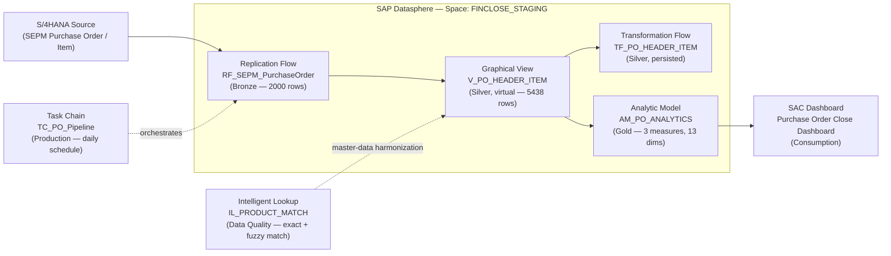

# Financial Close Copilot — Project README

**Status: COMPLETE**

## What this project is

An end-to-end SAP Datasphere data layer for a Financial Close scenario: raw
source replication through to a live SAC dashboard, plus the three
production-grade features (Task Chain, Transformation Flow, Intelligent
Lookup). Space used throughout: FINCLOSE_STAGING.

Working dataset was SEPM demo purchase order data, used as a stand-in because
journal-entry/finance CDS views were not extraction-enabled on the training
S/4 system. The pipeline structure is identical for real finance data — the
source object swaps in, the rest is unchanged.

## Architecture Diagram

Bronze → Silver (virtual view, joined at query time) → Gold (measures/dimensions
declared) → Consumption (live SAC). Silver is also materialized in parallel via
Transformation Flow for the persisted comparison. Task Chain schedules the
Bronze load; Intelligent Lookup is the reusable data-quality step for messy
master data, independent of the main flow.

Source (editable): `FINCLOSE_Architecture.drawio` in this folder.

## What was built and verified (Sections 0-7 of the runbook)

| # | Layer | Component | Result |
|---|---|---|---|
| 0 | — | Architecture / medallion model | Documented |
| 1 | Bronze | Replication Flow (RF_SEPM_PurchaseOrder) | 2000 rows landed |
| 2 | Silver (virtual) | Graphical View (V_PO_HEADER_ITEM), inner join | 5438 rows, inner vs left join tested — zero orphan rows |
| 3 | Gold | Analytic Model (AM_PO_ANALYTICS) | 3 measures, 13 dims, double-counting verified to the cent |
| 4 | Consumption | SAC Dashboard ("Purchase Order Close Dashboard") | Live table + chart on the model |
| 5 | Production | Task Chain (TC_PO_Pipeline) | Scheduled daily, verified in monitor |
| 6 | Silver (persisted) | Transformation Flow (TF_PO_Enriched → TF_PO_HEADER_ITEM) | Materialized table, run completed |
| 7 | Data Quality | Intelligent Lookup (IL_PRODUCT_MATCH) | Exact → Fuzzy chained rules; 10% auto, 65% review, 5% correctly unmatched |

All four "priority features" (Task Chain, Transformation Flow, Intelligent
Lookup, DAC) were completed — DAC conceptually, on the BDC trial rather than
the rental (see BDC_DS_SAC_Labs for that thread).

## Deliverables

- `Financial_Close_Copilot_Runbook.docx` — the illustrated step-by-step (this is the project artifact)
- `CONSOLIDATED_1_Datasphere_SAC.docx` / `.md` — feature explainers, observation checklist, SAC reference
- `NEXT_SESSION_PROMPT.md`, `RUNBOOK_outstanding_and_todo.md` — working notes from the build session

## Known polish items (not blockers)

- Two screenshots not yet embedded in the runbook (space creation, connection
  setup) — the text for these sections is already written.
- SAC dashboard status column shows raw codes (C/N/P/X) rather than readable
  labels — needs the status TEXT view.

## Out of scope for this project

Further SAP Business Data Cloud, Datasphere catalog, and SAC exploration
(real finance data-product consumption, DAC hands-on, custom data product +
Delta Share, Snowflake/Databricks inspection) was done as **separate,
follow-on labs after this project was complete** — not part of the Financial
Close Copilot deliverable. That work, and what's still open on it, is
tracked in `../BDC_DS_SAC_Labs/README.md` as a future roadmap.
